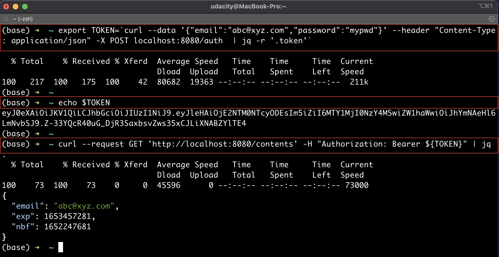

# Deploying a Flask API

Containerize and deploy a Flask API to a Kubernetes cluster using Docker, AWS EKS, CodePipeline, and CodeBuild.

The Flask app that will be used for this project consists of a simple API with three endpoints:

- `GET '/'`: This is a simple health check, which returns the response 'Healthy'. 
- `POST '/auth'`: This takes a email and password as json arguments and returns a JWT based on a custom secret.
- `GET '/contents'`: This requires a valid JWT, and returns the un-encrpyted contents of that token. 

The app relies on a secret set as the environment variable `JWT_SECRET` to produce a JWT. The built-in Flask server is adequate for local development, but not production, so you will be using the production-ready [Gunicorn](https://gunicorn.org/) server when deploying the app.

## Initial setup

AWS CLI installed and configured using the `aws configure` command. Another important configuration is the region. Do not use the us-east-1 because the cluster creation may fails mostly in us-east-1. Let's change the default region to:
```bash
aws configure set region us-east-2  
```
EKSCTL installed in your system. Follow the instructions [available here](https://docs.aws.amazon.com/eks/latest/userguide/eksctl.html#installing-eksctl) or <a href="https://eksctl.io/introduction/#installation" target="_blank">here</a> to download and install `eksctl` utility. 

The KUBECTL installed in your system. Installation instructions for kubectl can be found <a href="https://kubernetes.io/docs/tasks/tools/install-kubectl/" target="_blank">here</a>. 

```bash
# A secret text string to be used to creating a JWT 
export JWT_SECRET='myjwtsecret' 
export LOG_LEVEL=DEBUG 

# Verify 
echo $JWT_SECRET 
echo $LOG_LEVEL

python main.py

# To try the /auth endpoint, use the following command, replacing email/password as applicable to you:
export TOKEN=`curl --data '{"email":"abc@xyz.com","password":"mypwd"}' --header "Content-Type: application/json" -X POST localhost:8080/auth  | jq -r '.token'`

# This calls the endpoint 'localhost:8080/auth' with the email/password as the message body. The return value is a JWT token based on the secret string you supplied. We are assigning that secret to the environment variable 'TOKEN'. To see the JWT token, run:
echo $TOKEN

# To try the /contents endpoint which decrypts the token and returns its content, run:
curl --request GET 'http://localhost:8080/contents' -H "Authorization: Bearer ${TOKEN}" | jq .
```


## Containerize the Flask App and Run Locally

### Store Environment Variables

Containers cannot read the values stored in your localhost's environment variables. Therefore, create a file named .env_file and save both JWT_SECRET and LOG_LEVEL into that .env_file. We will use this file while creating the container. Here, we do not need the export command, just an equals sign:
```bash
JWT_SECRET='myjwtsecret'
LOG_LEVEL=DEBUG
```
### Build an image

```bash
docker build -t myimage .
docker run --name myContainer --env-file=.env_file -p 80:8080 myimage
docker container ls
docker ps
# Stop a container
docker container stop <container_id>
# Remove a container
docker container rm <container_id>

# Check the endpoints
# Flask server running inside a container
curl --request GET 'http://localhost:80/'
# Flask server running locally (only the port number is different)
curl --request GET 'http://localhost:8080/'

# You should see a "Healthy" response. For other two endpoints, try running the following commands:
# Calls the endpoint 'localhost:80/auth' with the email/password as the message body. 
# The return JWT token assigned to the environment variable 'TOKEN' 
export TOKEN=`curl --data '{"email":"abc@xyz.com","password":"WindowsPwd"}' --header "Content-Type: application/json" -X POST localhost:8080/auth  | jq -r '.token'`
echo $TOKEN
# Decrypt the token and returns its content
curl --request GET 'http://localhost:8080/contents' -H "Authorization: Bearer ${TOKEN}" | jq .
```

## Run the app on AWS Cloud

### Create an EKS Cluster, IAM Role for CodeBuild, and Authorize the CodeBuild
1. Create an EKS Cluster - Start with creating an EKS cluster in your preferred region, using eksctl command.
```bash
eksctl create cluster --name eksctl-demo --nodes=2 --version=1.22 --instance-types=t2.medium --region=us-east-2 --profile udacity-aws
```
2. IAM Role for CodeBuild - Create an IAM role that the Codebuild will assume to access your k8s/EKS cluster. This IAM role will have the necessary access permissions (attached JSON policies),
```bash
aws sts get-caller-identity --query Account --output text
## Returns the AWS account id similar to 
## 519002666132
aws iam create-role --role-name UdacityFlaskDeployCBKubectlRole --assume-role-policy-document file://trust.json --output text --query 'Role.Arn'
aws iam put-role-policy --role-name UdacityFlaskDeployCBKubectlRole --policy-name eks-describe --policy-document file://iam-role-policy.json
```
3. Authorize the CodeBuild using EKS RBAC - Add IAM Role to the Kubernetes cluster's configMap.
```bash
kubectl get -n kube-system configmap/aws-auth -o yaml > aws-auth-patch.yml

nano aws-auth-patch.yml
# and add the following group in the data → mapRoles section of this file:
 - groups:
   	- system:masters
   	rolearn: arn:aws:iam::<ACCOUNT_ID>:role/UdacityFlaskDeployCBKubectlRole
   	username: build  

kubectl patch configmap/aws-auth -n kube-system --patch "$(cat aws-auth-patch.yml)"    
```

### Deployment to Kubernetes using CodePipeline and CodeBuild
1. Generate a Github access token
Cenerate an access-token from your Github account. We will share this token with the Codebuild service so that it can listen to the the repository commits.

2. Create Codebuild and CodePipeline resources using CloudFormation template
Create a pipeline watching for commits to your Github repository using Cloudformation template (.yaml) file.

3. Set a Secret using AWS Parameter Store
In order to pass your JWT secret to the app in Kubernetes securely, you will set the JWT secret using AWS parameter store.

4. Build and deploy
Finally, you will trigger the build based on a Github commit.

## Project Steps

1. Write a Dockerfile for a simple Flask API
2. Build and test the container locally
3. Create an EKS cluster
4. Store a secret using AWS Parameter Store
5. Create a CodePipeline pipeline triggered by GitHub checkins
6. Create a CodeBuild stage which will build, test, and deploy your code
